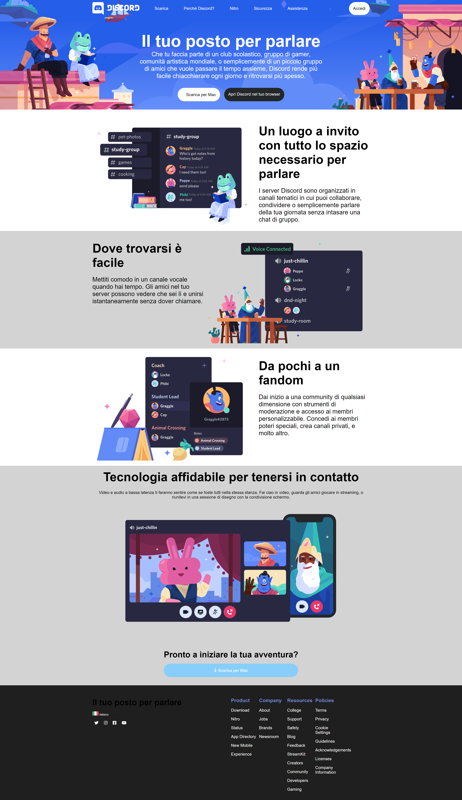

Il progetto consiste nella creazione di un sito vetrina per Discord, una rinomata piattaforma di comunicazione online. Utilizzando HTML e CSS, il sito presenta in modo accattivante le varie funzionalità e vantaggi offerti da Discord, come la possibilità di creare server tematici, comunicare tramite chat vocale e video, e costruire comunità online. Il design moderno e user-friendly del sito mira a fornire agli utenti una panoramica completa delle potenzialità di Discord e a invitarli ad unirsi alla sua vasta comunità online.

